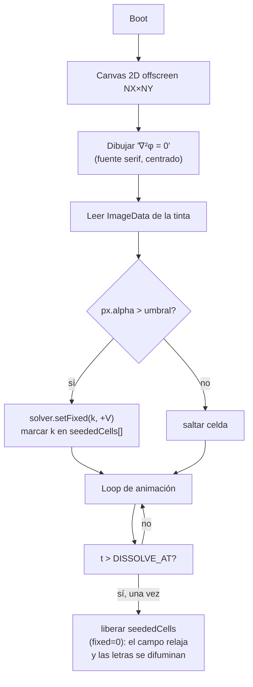
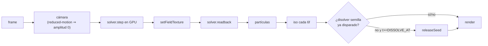
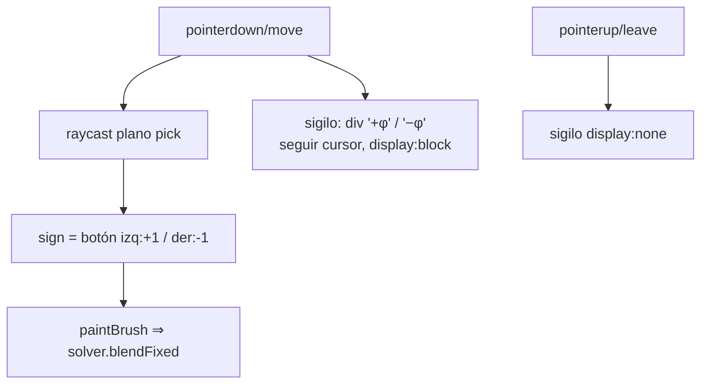

# Plan — Laplace presente en todo el diseño

> Issues: **#5** (lockup ∇²φ=0), **#9** (sigilos del pincel), **#11** (la ecuación
> sembrada en el campo), **#10** (responsivo + reduced-motion, transversal).
> Descartadas por el revisor: #6, #7, #8 (saturaban la composición / parecían dashboard).

## Principio rector

La pieza es **arte tipográfico**, no un dashboard. Presupuesto de texto en reposo:
**≤ 2 elementos**. La ecuación de Laplace debe estar presente en tres planos:

1. **En la firma** — ∇²φ = 0 fijo y tenue (#5).
2. **En la interacción** — el signo Dirichlet ±φ al pintar (#9).
3. **En la geometría misma** — el campo nace de las letras de la fórmula y se
   disuelve al converger (#11). Esta es la capa que hace literal el título
   "el campo que se asienta".

Coste total objetivo: ~50 líneas, sin dependencias nuevas.

---

## Diagrama de flujo — inicialización (issue #11)



## Diagrama de flujo — loop por frame (dónde engancha cada feature)



## Diagrama de flujo — pintado + sigilo Dirichlet (issue #9)



---

## Pseudocódigo

### #11 — ecuación sembrada en el campo (`src/seedEquation.ts`)
```
function seedEquation(solver):
  cv = canvas2D(NX, NY)
  ctx.font = bold serif ~NY*0.5; ctx.textAlign/baseline = center
  ctx.fillText("∇²φ = 0", NX/2, NY/2)
  data = ctx.getImageData(0,0,NX,NY).data
  seeded = []
  for j in 1..NY-2, i in 1..NX-2:
     a = data[(j*NX+i)*4 + 3]            # alfa de la tinta
     if a > 40:
        k = j*NX+i
        solver.setFixed(k, +0.85)        # polo positivo = la letra
        seeded.push(k)
  return releaseFn = () => for k in seeded: solver.unfix(k)   # fixed[k]=0, bc.g=0
```
> Requiere un método nuevo mínimo en `FieldSolver`: `unfix(k)` (poner `fixed=0`,
> `bcData[k*4+1]=0`, `needsUpdate`). 3 líneas.

### #5 — lockup (CSS + HTML, en `index.html`)
```
<div id="eq">∇²φ = 0</div>
#eq{ position:fixed; right:clamp(12px,3vw,28px); bottom:clamp(12px,3vw,28px);
     font:300 clamp(11px,1.5vw,15px) Spectral,serif; color:var(--amber);
     opacity:0; letter-spacing:.04em; pointer-events:none; z-index:5;
     animation: eqIn 2.4s ease 0.4s forwards; }
@keyframes eqIn{ to{ opacity:.22 } }
```

### #9 — sigilo del pincel (CSS + ~12 líneas en `main.ts`)
```
<div id="sig"></div>   # css: position:fixed; display:none; serif; amber; pointer-events:none
on pointerdown/move (mientras down):
   sig.textContent = sign>0 ? "+φ" : "−φ"
   sig.style.left/top = cursor (+offset); sig.style.display = "block"
on pointerup/cancel/leave: sig.style.display = "none"
```

### #10 — reduced-motion (transversal, en `main.ts` + CSS)
```
const REDUCED = matchMedia("(prefers-reduced-motion: reduce)").matches
const sway = REDUCED ? 0 : 1
camera.x = base.x + sin(...)*0.45*sway   # idem z,y
# CSS: @media (prefers-reduced-motion){ #eq{animation:none;opacity:.22} }
```

---

## Decisiones de arquitectura

- **Sin librería de typesetting** (KaTeX/MathJax). `∇²φ = 0` son caracteres Unicode
  que la serif del sistema dibuja bien; los subíndices conflictivos (ᵢⱼ) se evitan
  al descartar #6. Menos código, control total, cero peso extra.
- **La semilla reutiliza `solver.setFixed`** (ya existe). El único añadido al solver
  GPU es `unfix(k)`. No se toca el ping-pong ni los shaders.
- **Overlays como DOM**, no dibujados en el canvas WebGL: nítidos, responsivos con
  `clamp()`, accesibles, y separados del render (no afectan el readback ni el QA de
  "canvas no en blanco").
- **Presupuesto de texto respetado**: en reposo solo el lockup (#5). El sigilo (#9)
  vive solo durante el pintado. La fórmula sembrada (#11) ya se disolvió.

## Verificación

`/qa` (Chromium headless) antes y después: build OK, sin errores de consola/página,
contexto WebGL vivo, `nonBlankRatio` alto. Los overlays DOM no deben introducir
errores ni tapar el canvas (`pointer-events:none`).
